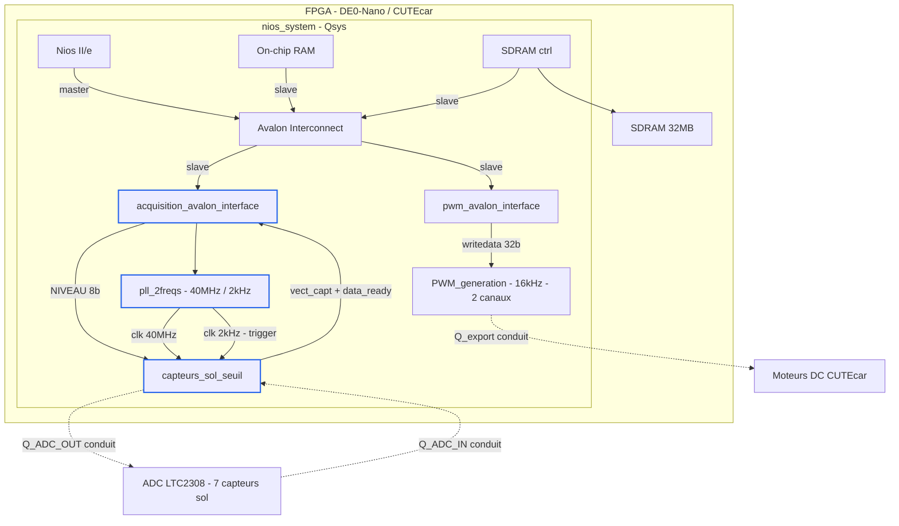

# Composant Qsys Acquisition — Détection de ligne CUTEcar

## Présentation du projet

Ce projet implémente un composant Qsys personnalisé nommé **Acquisition** destiné à la lecture des capteurs sol du robot **CUTEcar** sur carte DE0-Nano (FPGA Altera Cyclone IV). Le composant pilote un ADC **LTC2308** via SPI pour acquérir les valeurs des 7 capteurs infrarouge, les compare à un seuil configurable, et retourne un vecteur binaire `vect_capt[6:0]` indiquant la position du robot par rapport à la ligne noire.

---

## Architecture du système



---

## Principe de fonctionnement

Le composant `acquisition_avalon_interface` orchestre trois sous-modules :

1. **`pll_2freqs`** — génère deux horloges à partir du 50 MHz système :
   - `c0` = **40 MHz** : horloge SPI pour le LTC2308
   - `c1` = **2 kHz** : signal de déclenchement des acquisitions (`data_capture`)

2. **`capteurs_sol_seuil`** — pilote le LTC2308 en SPI, lit les 7 canaux ADC (12 bits), tronque à 8 bits significatifs et compare chaque valeur au seuil `NIVEAU` :
   - `vect_capt[i] = 1` si `data[i] > NIVEAU` (capteur au-dessus de la ligne)
   - `vect_capt[i] = 0` sinon

3. **`acquisition_avalon_interface`** — registre Avalon MM slave :
   - en écriture : reçoit le seuil `NIVEAU` (bits [7:0] de `writedata`)
   - en lecture : retourne `data_ready` (bit 0) et `vect_capt[6:0]` (bits [7:1])

---

## Registre de commande Avalon

| Accès | Bits | Champ | Description |
|-------|------|-------|-------------|
| Write | [7:0] | `NIVEAU` | Seuil de comparaison ADC (0–255) |
| Write | [31:8] | — | Réservés |

Le résultat `vect_capt[6:0]` n'est pas destiné à être lu par le Nios II : il est exporté directement sur les LEDs via le conduit `Q_export[7:1]` dans `sysRobot.vhd`.

---

## Signaux de acquisition_avalon_interface

**Entrées — Nios II → composant**

| Signal | Type | Description |
|--------|------|-------------|
| `clock` | STD_LOGIC | Horloge 50 MHz |
| `resetn` | STD_LOGIC | Reset actif bas |
| `chipselect` | STD_LOGIC | Sélection du composant |
| `write` | STD_LOGIC | Transaction écriture |
| `read` | STD_LOGIC | Transaction lecture |
| `writedata[31:0]` | SLV 31:0 | Seuil NIVEAU (bits [7:0]) |
| `byteenable[3:0]` | SLV 3:0 | Masque octet |

**Sorties — composant → extérieur**

| Signal | Type | Description |
|--------|------|-------------|
| `readdata[31:0]` | SLV 31:0 | data_ready + vect_capt |
| `Q_ADC_OUT[0]` | STD_LOGIC | LTC_ADC_CONVST — déclenchement conversion |
| `Q_ADC_OUT[1]` | STD_LOGIC | LTC_ADC_SCK — horloge SPI |
| `Q_ADC_OUT[2]` | STD_LOGIC | LTC_ADC_SDI — données SPI vers ADC |
| `Q_export[0]` | STD_LOGIC | data_ready — export vers LEDs |
| `Q_export[7:1]` | SLV 7:1 | vect_capt[6:0] — export vers LEDs |

**Entrée conduit — ADC → composant**

| Signal | Type | Description |
|--------|------|-------------|
| `Q_ADC_IN` | STD_LOGIC | LTC_ADC_SDO — données SPI depuis ADC |

> `Q_ADC_OUT`, `Q_ADC_IN` et `Q_export` sont des **conduits Avalon** : non routés sur l'interconnect MM, connectés directement aux broches physiques du FPGA dans `sysRobot.vhd`.

---

## Arborescence du projet

```
CUTEcar_acquisition/
│
├── sysRobot.vhd                        # Top-level VHDL — instancie nios_system,
│                                       # connecte FPGA aux E/S physiques
│                                       # (CLOCK_50, KEY, DRAM_*, LTC_ADC_*, MTRR/MTRL)
│
├── nios_system/
│   ├── nios_system.qsys                # Fichier de projet Qsys
│   └── synthesis/
│       └── nios_system.qip             # Fichier d'inclusion pour Quartus II
│
├── ip_cores/
│   ├── CAPTEURS/
|         ├── acquisition_avalon_interface.vhd  # Interface Avalon MM slave (composant custom)
│         │                                     # Registre R/W, instancie pll_2freqs
│         │                                     # et capteurs_sol_seuil
│         ├── capteurs_sol_seuil.vhd            # Pilote SPI LTC2308, seuillage 7 capteurs,
│         │                                     # retourne vect_capt[6:0]
│         └──pll_2freqs.vhd                    # PLL Altera — génère 40 MHz et 2 kHz
│                                              # depuis horloge 50 MHz système
|   └── PWM/
│         ├── pwm_avalon_interface.vhd          # Interface Avalon MM slave PWM
│         └── PWM_generation.vhd               # Logique PWM 16 kHz 2 canaux
│
└── software/
    └── carac-motor.c                     # Code C Nios II — Détermination expérimentale
                                          # de la vitesse minimale de démarrage des roues.
                                          # Envoie des commandes PWM croissantes via
                                          # IOWR_32DIRECT à PWM_AVALON_INTERFACE_0_BASE
                                          # (adresse définie dans system.h, générée par le BSP)
```

---

## Utilisation depuis le logiciel Nios II

Le Nios II écrit le seuil `NIVEAU` directement en mémoire à l'adresse du composant. Le résultat `vect_capt[6:0]` est retourné en temps réel sur les LEDs physiques de la carte via le conduit `Q_export`.

---

## Remarques de conception

- La PLL génère **40 MHz** pour le SPI (contrainte max du LTC2308) et **2 kHz** comme cadence d'acquisition des capteurs, soit une mesure toutes les 500 µs.
- Le seuil `NIVEAU` (8 bits) est configurable par le logiciel Nios II, ce qui permet d'ajuster la sensibilité selon les conditions d'éclairage sans recompiler le bitstream.
- Les données ADC sont sur 12 bits ; seuls les 8 bits de poids fort (`data[11:4]`) sont conservés pour le seuillage, ce qui simplifie le calcul tout en conservant une résolution suffisante.
- `Q_export[7:0]` est câblé sur les LEDs dans `sysRobot.vhd` pour visualiser en temps réel la position du robot sur la ligne.
