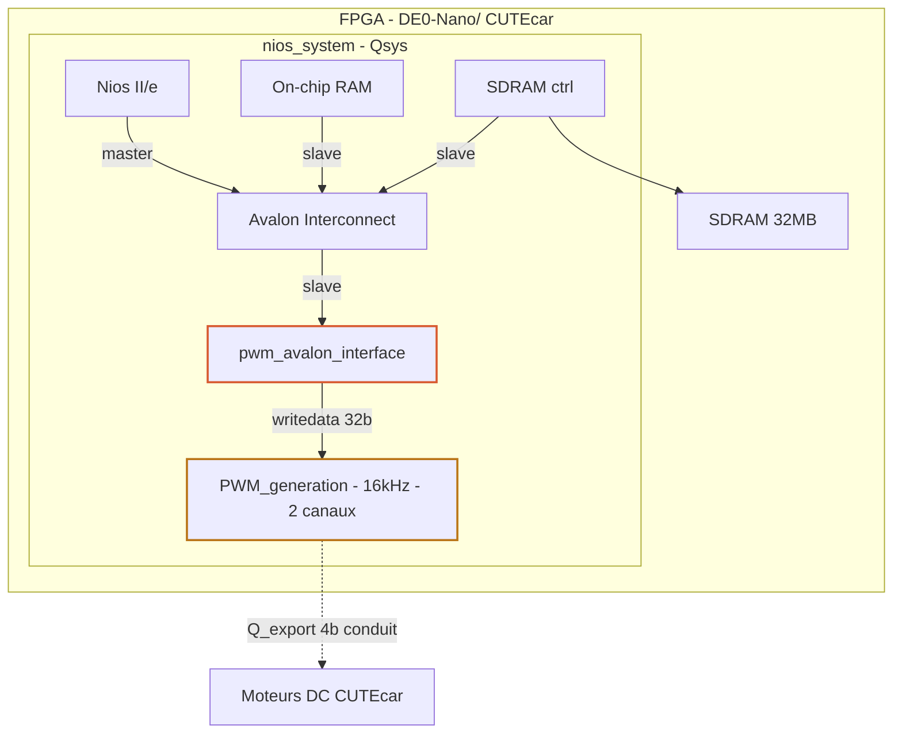

# Composant Qsys PWM — Contrôle moteur CUTEcar

## Présentation du projet

Ce projet implémente un composant Qsys personnalisé nommé **PWM** destiné au contrôle des moteurs à courant continu du robot **CUTEcar** sur carte DE0-Nano (FPGA Altera Cyclone V). Le composant est intégré dans un système embarqué Nios II via le bus **Avalon Memory-Mapped (MM)** et génère deux signaux PWM indépendants — un par roue — permettant le contrôle en vitesse, sens de rotation et arrêt de chaque moteur.

---

## Architecture du système

Le schéma ci-dessous présente l'architecture globale, inspirée de la figure 1 du tutoriel *Making Qsys Components* (Altera, 2013). Le système généré par Qsys (`nios_system`) s'instancie dans le top-level VHDL `sysRobot` qui porte les entrées/sorties physiques de la carte.



### Signaux de pwm_avalon_interface

**Entrées — Nios II → composant**

| Signal | Type | Description |
|--------|------|-------------|
| `clock` | STD_LOGIC | Horloge 50 MHz |
| `resetn` | STD_LOGIC | Reset actif bas |
| `chipselect` | STD_LOGIC | Sélection du composant |
| `write` | STD_LOGIC | Transaction écriture |
| `read` | STD_LOGIC | Transaction lecture |
| `writedata[31:0]` | SLV 31:0 | Commande moteurs |
| `byteenable[3:0]` | SLV 3:0 | Masque octet |

**Sorties — composant → extérieur**

| Signal | Type | Description |
|--------|------|-------------|
| `readdata[31:0]` | SLV 31:0 | Relecture registre |
| `Q_export[0]` | STD_LOGIC | MTRR_P — moteur droit avant |
| `Q_export[1]` | STD_LOGIC | MTRR_N — moteur droit arrière |
| `Q_export[2]` | STD_LOGIC | MTRL_P — moteur gauche avant |
| `Q_export[3]` | STD_LOGIC | MTRL_N — moteur gauche arrière |

> `Q_export[3:0]` est un **conduit Avalon** : non routé sur l'interconnect MM, exporté directement vers les sorties physiques du FPGA dans `sysRobot.vhd`.

---

## Interface Avalon — Registre de commande

Le composant expose **un unique registre 32 bits** en lecture/écriture à l'adresse assignée par Qsys.

| Bits | Champ | Description |
|------|-------|-------------|
| [13:0] | Commande moteur droit (R) | bit 13 : go/stop — bit 12 : sens (0=avant, 1=arrière) — bits [11:0] : durée état haut (vitesse) |
| [27:14] | Commande moteur gauche (L) | même encodage que les bits [13:0] |
| [31:28] | Réservés | non utilisés |

La largeur de l'impulsion (bits [11:0]) est comparée au compteur interne du générateur PWM. Plus la valeur est élevée, plus le rapport cyclique est grand et la vitesse est élevée. La période totale vaut `fFPGA / fPWM = 50 000 000 / 16 000 = 3125 tops d'horloge`.

### Signaux de l'interface Avalon MM slave

| Signal | Direction | Rôle |
|--------|-----------|------|
| `clock` | entrée | Horloge système (50 MHz) |
| `resetn` | entrée | Reset actif bas |
| `chipselect` | entrée | Sélection du composant |
| `write` | entrée | Transaction d'écriture |
| `read` | entrée | Transaction de lecture |
| `writedata[31:0]` | entrée | Données envoyées par le maître |
| `readdata[31:0]` | sortie | Relecture du registre interne |
| `byteenable[3:0]` | entrée | Masque d'activation par octet |
| `Q_export[3:0]` | sortie (conduit) | Signaux PWM vers les moteurs |

---

## Arborescence du projet

Seuls les fichiers essentiels à la compréhension et à la synthèse du projet sont listés ci-dessous.

```
CUTEcar_PWM/
│
├── sysRobot.vhd                  # Top-level VHDL — instancie nios_system,
│                                 # connecte l'FPGA aux E/S physiques de la carte
│                                 # (CLOCK_50, KEY, LED, DRAM_*, MTRR/MTRL)
│
├── nios_system/                  # Système généré par Qsys
│   ├── nios_system.qsys          # Fichier de projet Qsys (composants + connexions)
│   └── synthesis/
│       └── nios_system.qip       # Fichier d'inclusion pour Quartus II
│
├── ip_cores/  
|    ├── pwm_avalon_interface.vhd      # Interface Avalon MM slave (composant custom Qsys)
│    |                            # Registre 32 bits R/W, instancie PWM_generation,
│    |                            # expose Q_export[3:0] en conduit
|    └── PWM_generation.vhd            # Logique PWM pure — 2 canaux 16 kHz,
│                                 # go/stop + sens + vitesse par roue
│
└── software/
    └── carac-motor.c             # Code C Nios II — Détermination expérimentale
                                  # de la vitesse minimale de démarrage des roues.
                                  # Envoie des commandes PWM croissantes via
                                  # IOWR_32DIRECT à PWM_AVALON_INTERFACE_0_BASE
                                  # (adresse définie dans system.h, générée par le BSP)
```

---

## Utilisation depuis le logiciel Nios II

Depuis le code C tournant sur le Nios II, le registre PWM se pilote par une simple écriture en mémoire à l'adresse de base assignée par Qsys:

```c
#define PWM_MAX 0xFFF

// Construction commande moteur 14 bits
uint16_t motor_cmd(uint8_t go, uint8_t backward, uint16_t speed)
{
    speed &= PWM_MAX;

    return (go << 13) | (backward << 12) | speed;
}

int main()
{
    uint16_t vitesse;

    uint16_t motorR;
    uint16_t motorL;

    uint32_t data;

    printf("Caracterisation moteur PWM\n");

    while (1)
    {
        // Balayage PWM
        for (vitesse = 0; vitesse <= PWM_MAX; vitesse += 0x20)
        {
            // GO = 1
            // DIR = 0 -> forward
            motorR = motor_cmd(1, 0, vitesse);
            motorL = motor_cmd(1, 0, vitesse);

            // Packing registre 32 bits
            data = ((uint32_t)motorL << 14) | motorR;

            // Ecriture Avalon
            IOWR(PWM_AVALON_INTERFACE_1_BASE, 0, data);

            // Affichage
            printf("PWM = 0x%03X (%4d)   DATA = 0x%08X\n",
                   vitesse,
                   vitesse,
                   data);

            // Attente 200 ms
            usleep(200000);
        }

        // STOP moteurs
        IOWR(PWM_AVALON_INTERFACE_1_BASE, 0, 0);

        printf("Fin balayage\n");

        // Pause 2 secondes
        usleep(2);
    }
}
```

---

## Remarques de conception

- La fréquence PWM de **16 kHz** est choisie pour rester au-delà du spectre audible et assurer une réponse dynamique suffisante pour un robot de petite taille.
- La direction est gérée par commutation des broches `_P` (positive) et `_N` (négative) du pont en H : une seule broche reçoit le signal PWM à la fois, l'autre est maintenue à `'0'`.
- Le signal `Q_export[3:0]` est exporté en tant que **conduit Avalon** (non routé sur l'interconnect), puis connecté dans `sysRobot.vhd` directement aux sorties physiques `MTRR_P`, `MTRR_N`, `MTRL_P`, `MTRL_N`.
- La relecture (`read`) du registre retourne l'état courant de `to_reg`, ce qui permet au logiciel de vérifier la commande effectivement envoyée aux moteurs.
